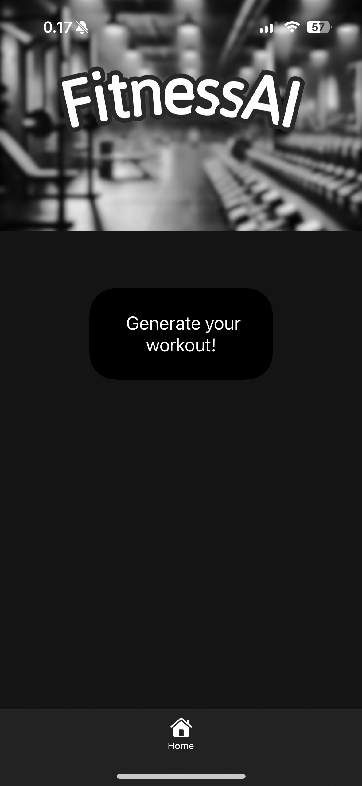
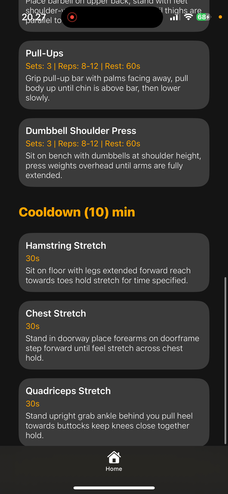
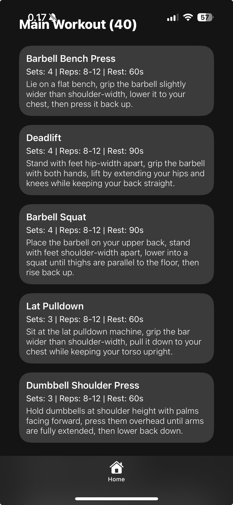
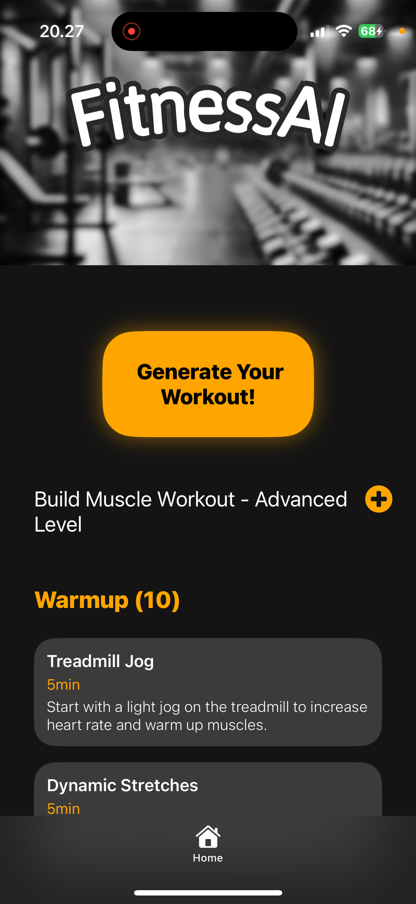

# Workout Generator App

A React Native application that generates personalized workout plans using AI. Built with Expo and TypeScript.

## Features

**AI-Powered Workout Plans**: Generates customized workouts based on:

- Fitness goals (Build Muscle, Lose Weight, Get Stronger, Stay Healthy)
- Experience level
- Available equipment
- Workout duration
- Gender preferences

**Structured Workout Format**:

- Warm-up exercises with durations
- Main workout with sets, reps, and rest periods
- Cool-down stretches
- Detailed exercise descriptions

## Tech Stack

- React Native with Expo
- TypeScript
- Reanimated for animations
- Deepseek AI API for workout generation
- File-based routing with Expo Router

## Getting Started

1. Clone the repository:

```bash
git clone [your-repo-url]
cd ReactNative-App
```

2. Install dependencies:

```bash
npm install
```

3. Set up environment variables:
   Create a `.env` file in the root directory:

```plaintext
EXPO_PUBLIC_DEEPSEEK_API_KEY=your_api_key_here
```

4. Start the development server:

```bash
npx expo start
```

## Project Structure

```
ReactNative-App/
├── app/                    # Main application code
│   ├── (tabs)/            # Tab-based navigation
│   └── _layout.tsx        # Root layout configuration
├── assets/                # Static assets and images
├── components/            # Reusable UI components
├── contexts/              # React Context providers
└── services/             # API  logic
```

## Screenshots





